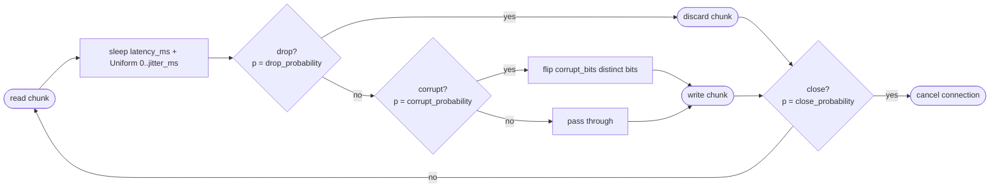

# netfault

A TCP proxy that injects network faults — latency, packet loss, corruption,
and connection drops — for testing how applications behave under adverse
network conditions.

`netfault` sits between a client and any TCP-speaking service, applies a
configurable fault pipeline to every chunk it forwards, and gives you a
reproducible way to see how your code handles the resulting chaos.

## Why

Mocking network failures at the application layer misses everything
interesting about how a network actually breaks: partial writes, half-open
sockets, corruption at arbitrary byte boundaries, mid-stream disconnects.
Injecting the faults at the TCP level surfaces the code paths that
app-layer mocks don't — the retry loop that hammers a dying downstream,
the timeout that never actually fires, the checksum that happily accepts
a mangled frame.

Pin the seed and any run reproduces bit-for-bit.

I built this mainly to work through TCP-level networking and async Rust
end-to-end — sockets, backpressure, cancellation — rather than something
I'd only read about.

## Architecture

```
                      +-----------------------+
     TCP client  ---->|    netfault (accept)  |----> TCP target
                      |                       |
                      |   per-connection:     |
                      |   +---------------+   |
                      |   | c2s pipeline  |   |
                      |   +---------------+   |
                      |   +---------------+   |
                      |   | s2c pipeline  |   |
                      |   +---------------+   |
                      +-----------------------+
```

One accept loop, one handler task per connection, two forwarding tasks per
handler (client → server and server → client), and a fault pipeline
per direction. The two directions have independent configs, independent
seeded RNGs, and independent statistics. A single global `CancellationToken`
is the shutdown signal for Ctrl+C; each connection gets a `child_token()`,
so a fault-close inside one connection tears down only that connection while
Ctrl+C tears down all of them.

I didn't use `tokio::io::copy_bidirectional` for the forwarding. The fault
pipeline needs to sit between the read and the write on every chunk, and
`copy_bidirectional` hides that seam. Each direction is its own task doing
an explicit `read → pipeline → write` loop instead.

### Fault pipeline (per chunk, per direction)

Every chunk read from the wire runs through this pipeline before it's written
to the peer. The order is fixed:



Notes:
- `drop` runs before `corrupt`, so a dropped chunk is never also corrupted
  (there's nothing left to flip). `close` is evaluated regardless — a dropped
  chunk is still a *processed* chunk.
- Bit flips are sampled **without replacement**, so `corrupt_bits = k`
  produces an output whose Hamming distance from the input is exactly `k`.
- Each direction of each connection has its own `StdRng`, seeded from the
  master seed with SplitMix64-style mixing. Two connections running in
  parallel with the same master seed produce reproducible fault sequences
  that don't depend on scheduling order.

## Configuration

`netfault` loads a TOML file (via `-c/--config`) and lets you override the
runtime knobs on the command line. Fault parameters live only in the file;
runtime settings (`listen`, `target`, `seed`) can come from either source,
with CLI winning on conflict.

### Full config schema

```toml
# Top-level (all optional at the file level; something must supply listen and
# target between the file and CLI flags).
listen = "127.0.0.1:8080"     # bind address for the proxy
target = "127.0.0.1:9000"     # forward every accepted connection here
seed   = 12345                # PRNG master seed; if omitted, a random one is
                              # drawn and logged at startup

# Fault settings for chunks flowing from the client to the target.
[client_to_server]
latency_ms         = 50   # fixed sleep applied to every chunk (ms)
latency_jitter_ms  = 25   # additional Uniform(0, jitter_ms) sleep (ms)
drop_probability   = 0.05 # per-chunk chance to silently drop (0.0..=1.0)
corrupt_probability = 0.02 # per-chunk chance to corrupt (0.0..=1.0)
corrupt_bits       = 3    # if corrupt fires, flip this many DISTINCT bits
close_probability  = 0.001 # per-chunk chance to tear down the connection

# Fault settings for chunks flowing from the target back to the client.
# Same schema. Any field you omit defaults to 0 / 0.0 (i.e. do nothing).
[server_to_client]
latency_ms = 10
```

- All probabilities must be in `[0.0, 1.0]` and non-NaN, or `netfault` refuses
  to start.
- Unknown TOML fields are rejected (typos fail loudly instead of silently
  defaulting).
- Defaults for every fault field are a benign 0 / 0.0, so a partial
  `[client_to_server]` block is fine.

An example config lives at [`examples/netfault.toml`](examples/netfault.toml).

### CLI

```
netfault [OPTIONS]

Options:
  -c, --config <PATH>  Path to a TOML config file
  -l, --listen <ADDR>  Local address to bind (overrides `listen`)
  -t, --target <ADDR>  Target address to forward to (overrides `target`)
  -s, --seed <N>       PRNG seed (overrides `seed`)
  -h, --help           Print help
  -V, --version        Print version
```

`--listen` and `--target` are required if the config file (or its absence)
doesn't supply them. Log verbosity is controlled by `RUST_LOG` (see the
[`tracing` docs](https://docs.rs/tracing-subscriber)); default is `info`.

## Example: run in front of a local HTTP server

Terminal 1 — a plain HTTP server:

```
python -m http.server 9000
```

Terminal 2 — save the following as `laggy.toml` and start `netfault`:

```toml
listen = "127.0.0.1:8080"
target = "127.0.0.1:9000"
seed   = 42

[client_to_server]
latency_ms = 500
```

```
netfault --config laggy.toml
```

Terminal 3 — hit the proxied port and observe the added latency:

```
$ curl -s -o /dev/null -w 'total: %{time_total}s\n' http://127.0.0.1:9000/
total: 0.003s

$ curl -s -o /dev/null -w 'total: %{time_total}s\n' http://127.0.0.1:8080/
total: 0.507s
```

The direct call to the HTTP server finishes in a few milliseconds; the same
request through `netfault` picks up ~500 ms on the client-to-server path.

### Loss / disconnect scenario

Swap the config for something meaner:

```toml
listen = "127.0.0.1:8080"
target = "127.0.0.1:9000"
seed   = 42

[client_to_server]
drop_probability  = 0.5
close_probability = 0.1
```

`curl` will now stall (dropped request chunks) or hang up mid-response
(close fault), and a client with retry logic will get to exercise its
backoff path.

Press `Ctrl+C` in the `netfault` terminal to shut down. You'll see a
summary block showing per-direction bytes and per-fault-type counts,
along with the seed used — enough to reproduce the same run later:

```
============================
 netfault shutdown summary
============================
seed                   : 42
connections handled    : 12
bytes forwarded c -> s : 4820
bytes forwarded s -> c : 158102
faults injected (c2s):
  latency events       : 0
  chunks dropped       : 14
  chunks corrupted     : 0
  close fault fired    : 3
faults injected (s2c):
  latency events       : 0
  chunks dropped       : 0
  chunks corrupted     : 0
  close fault fired    : 0
============================
```

## Building

```
cargo build --release
./target/release/netfault --help
```

Requires a stable Rust toolchain (2021 edition).

## Testing

```
cargo test               # unit + integration
cargo clippy --all-targets -- -D warnings
cargo fmt --check
```

The suite includes deterministic **statistical** unit tests for each fault
(4-sigma binomial tolerance on observed rates over 10,000 trials with a fixed
seed) plus end-to-end integration tests that spin up an in-process echo server
and a real proxy on ephemeral ports.

## Known limitations

This is a dev/staging tool. The fault pipeline is the point; the proxy
scaffolding around it is deliberately minimal.

TLS isn't handled specially — handshakes flow through as bytes, and any
injected drop or corruption kills the session at the first bad record.

No `max_connections` cap, no per-connection buffer cap, no backpressure.
The accept loop happily spawns a task per socket, so a pathological
client can OOM the process.

Per-chunk allocation: each read is copied into a fresh `Vec<u8>` so the
pipeline can mutate in place. Fine here; wouldn't fly as an L4 balancer.

No auth. No config reload. No Prometheus or OTel export — a stdout
summary plus `tracing` logs is what you get. No clustering, no
multi-target routing.

The Ctrl+C drain window is hardcoded to 5s. Anything still in flight
after that gets aborted, though its partial stats are already in the
counters — those update per chunk, not per connection close.

## License

MIT — see [LICENSE](LICENSE).
